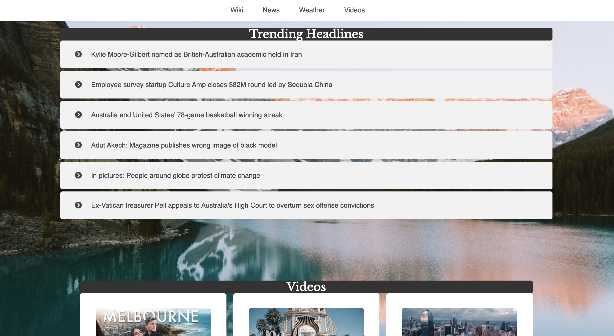

<h1>Travel Destination Search</h1>

A travel-inspired city search application. Users select a city and are returned travel information including a brief history, news headlines, videos, and a five day forecast for the chosen city.
<h2>Motivation</h2>
    
I wanted to create an app where users could find content important to travelers combined all in one place.

<h2>Demo</h2>
<a href="https://brandiherrera.github.io/travel-destination-search-api-capstone/">Live Demo</a>
<!--<h2>Build Status</h2>
    

-->
<h2>Screenshots</h2>
    <h3>Landing Page:</h3>
        
    <h3>Search Result Page: Wikipedia Section</h3>
        
    <h3>Search Result Page: News Section</h3>
        
    <h3>Search Result Page: News Section, Article Clicked</h3>
        
    <h3>Search Result Page: YouTube Travel-Specific Videos</h3>
        
    <h3>Search Result Page: Five Day Forcast Section</h3>    
        
<h2>Built With</h2>
    <h3>Front-End</h3>
        <ul>
            <li>HTML</li>
            <li>CSS</li>
            <li>JavaScript</li>
            <li>jQuery</li>
        </ul>
<h2>Features</h2>
    <ul>
        <li>Select country from a list on landing page</li>
        <li>Once selected, landing page disappears and search results with a navigation bar are shown</li>
        <li>Search results page displays with the following content sections</li>
        <ol>
            <li>Wikipedia section specifically for the city</li>
            <li>Current news articles in the city with an interactive accordion feature where the user can select which article to expand and select "Read More" to read the full article</li>
            <li>YouTube travel-based videos specific to the city and country where user may select "Watch Video" to watch the full clip</li>
            <li>Five day forecast for city and country</li>
        </ol>
        <li>Restart quiz option at bottom of search results page
    </ul>
    
Application is responsive using CSS flexbox and media queries with the smallest breakpoint starting at 450px.
<h2>Environment Setup</h2>
    
An API key is required to call information from the APIs implemented in this application
.<h2>Development Road Map</h2>
    <ul>
        <li>Add city suggestion feature so users may request a city not listed</li>
        <li>Add a "Top Attractions" section that features the most recommended tourist attractions</li>
        <li>Add a currency conversion feature</li>
    </ul>